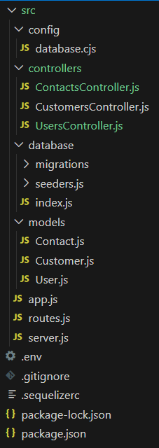

# 🌐 Aula 09 - Modelando nosso projeto
## 🎯 Objetivos
---
* Revisar arquitetura MVC (rapidamente no quadro)
* Tipos de arquivos executáveis do Node.js
* Preparando para iniciar novo projeto
* Modelagem do projeto
---
### 🗂️ Tipos de arquivos executáveis do Node.js
> O node tem seu código javascript gravado em arquivos com as seguintes extensões:
> * .js -> Arquivos com código javascript (usado para CMJ ou ESM)
> * .cjs -> Arquivos com código javascript usando notação **CommonJS**
> * .mjs -> Arquivos com código javascript usando notação **ES Modules**
---
### 🛠️ Procedimentos para criar um novo projeto
> Para que possamos então criar um novo projeto usando node vamos executar os passos abaixo:

1º) Criar uma nova pasta, acessar a pasta e instalar as bibliotecas do Node.js
```bash
$ cd
$ mkdir nova-api
$ cd nova-api
$ npm init -y
$ npm install express dotenv sequelize @sequelize/mariadb
$ npm install sequelize-cli --save-dev
```
2º) Preparar o gerenciador de código (git)
```bash
$ echo "node_modules/" > .gitignore
$ echo ".env" >> .gitignore
$ git init
$ git add .
$ git commit -m "Primeiro commit para início do projeto"
```
3º) Se necessário, preparar o SGBD
```bash
sudo mysql
```
Ao acessar a console do SGBD:
```sql
CREATE DATABASE minhabasededados;
CREATE USER 'meuusuario'@'localhost' IDENTIFIED BY 'minhasenhadobanco';
GRANT ALL PRIVILEGES ON minhabasededados.* TO 'meuusuario'@'localhost';
FLUSH PRIVILEGES;
```
4º) Editar o arquivo `package.json`
> Vamos editar o arquivo para identificar nosso desenvolvimento. Lembrado que é um arquivo `json`.
```json
  "name": "nome do nosso projeto",
  "version": "1.0.0 - devemos ajustar conforme o desenvolvimento evolui",
  "description": "Uma descriacao do nosso projeto",
  "main": "./src/server.js - quem deve ser iniciado",
  "type": "module",
  "author": {
    "name": "Nome do autor se for o caso",
    "email": "email de contato se necessario"
  },
  "keywords": [],
  "license": "ISC",
.
. Vai seguir com as dependências instaladas.
.
```
5º) Criar o arquivo `.env` com as variáveis de ambiente necessárias
```js
# API configuration
PORT=8080
# database configuration
USERNAMEDB='usuario_da_base_dados'
PASSWORDDB='senha_acesso_base_dados'
HOSTDB='servidor_nome_ou_IP'
PORTDB='porta_do_banco_dados'
NAMEDB='nome_base_dados'
# sequelize configuration
DIALECTDB='mariadb'
```

6º) Iniciar a estrutura de pastas do projeto
> Precisamos "montar" a estrutura de pastas do nosso projeto para que cada "coisa" fique organizada no seu lugar. Um exemplo de estrutura temos abaixo:



7º) Iniciar o desenvolvimento do projeto
> Precisamos agora iniciar o desenvolvimento do nosso projeto. Lembrando que temos alguns arquivos que tratam do processo de iniciar o programa. Lembrando que no arquivo package.json citamos na tag `main` qual seria o arquivo de inicio do programa (ou nosso web server), e que este chama um outro programa que é nossa aplicação em si (digamos assim, que vai estar no primeiro programa).

```bash
./src/app.js
```
```js
import express from 'express';
import { configDotenv } from 'dotenv';

configDotenv();

class App {
  constructor() {
    this.server = express();
    this.middlewares();
  }

  middlewares() {
    this.server.use(express.json());
  }

  routes() {
    this.server.use(express.json());
  }
}

export default new App().server;
```
```bash
./src/server.js
```
```js
import app from "./app.js";

app.listen(process.env.PORT || 3000, () => {
  console.log(`Server is running on port ${process.env.PORT || 3000}`);
});
```

> Com isto já devemos ter um servidor com capacidade de rodar, vamos testar!
---

### Material produzido em aula
`src/server.js`
```js
import app from "./app.js";

app.listen(process.env.PORT || 3000, () => {
  console.log(`Server is running on port ${process.env.PORT || 3000}`);
});

`src/app.js`
```js
import express from 'express';
import { configDotenv } from 'dotenv';
import routes from './routes.js';

configDotenv();

class App {
  constructor() {
    this.server = express();
    this.middlewares();
    this.routes();
  }

  middlewares() {
    this.server.use(express.json());
  }

  routes() {
    this.server.use(routes);
  }
}

export default new App().server;

`src/routes.js`
```js
import { Router } from 'express';

const routes = new Router();

routes.get('/', (req, res) => {
  res.json({ message: 'Welcome to the Library API! SELECT YOUR CLASS/METHOD.' });
});

// Usuários
// Listar todos os usuários
routes.get('/users', (req, res) => {
    res.json({ message: 'Você entrou na listagem de todos os usuários!'})
});
// Listar um usuário
routes.get('/users/:id', (req, res) => {
    res.json({ message: 'Você entrou na listadem de um  usuário.' })
});
// Criar um usuário
routes.post('/users', (req, res) => {
    res.json({ message: 'Você está criando um uusário.'})
});
// Editar um usuário
routes.put('/users/:id', (req, res) => {
    res.json({ message: 'Você esta editado um user.'})
});
// Deletar um usuário
routes.delete('/users/:id', (req, res) => {
    res.json({ message: 'Você deletou o usuário.'})
});

// Livros
// ...
//routes.get('/books',);
//routes.get('/books',);
//routes.get('/books',);
//routes.get('/books',);
//routes.get('/books',);

export default routes;
```
```
```
