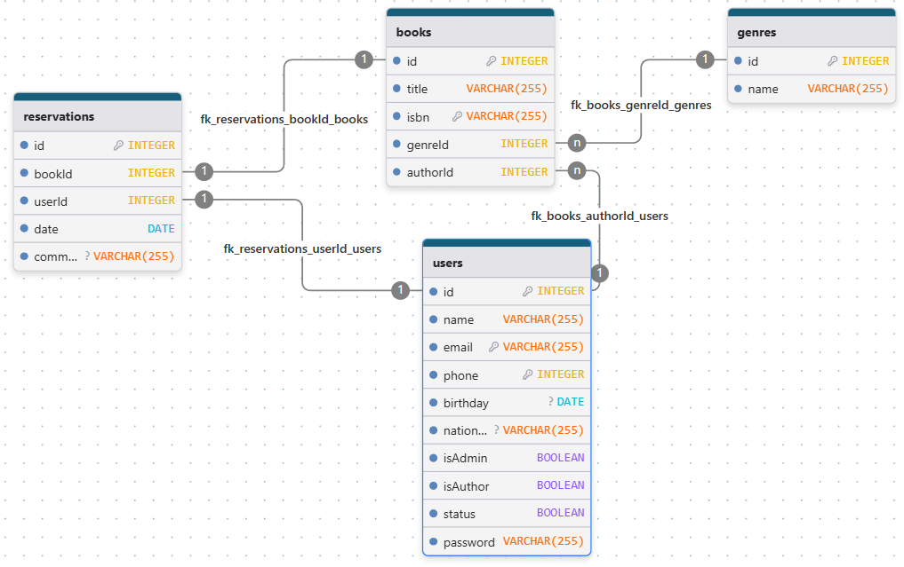

# 📺 Aula 10 - Implementando ORM no nosso projeto

## 🎯 Objetivos
- O que é um ORM
- ORM no Nodejs - Sequelize
- Usando o Sequelize: instalação, configuração, models, migrations e seeds

---
## 🧾 ORM - Object Relational Mapping
> O mapeamento objeto relacional é uma técnica usada para criar uma ponte entre nossos programas e os bancos de dados relacionais. Podemos assim considerar que o ORM é uma camada entre conecta nossa programação OOP com as tabelas em um banco de dados.
> Por se tratar de uma camada entre os programas e o banco de dados, fica mais fácil portar nossa aplicação para outros SGBDs sem precisar severas modificações de código.
> Claro que nem tudo são maravilhas, as ferramentas de ORM tem suas vantagens e desvantagens que devem sempre ser analisadas quando vamos desenvolver algo.

### ⬆️ Vantagens
- Acelera o tempo de desenvolvimento para equipes.
- Diminui o custo de desenvolvimento.
- Lida com a lógica necessária para interagir com os bancos de dados.
- Melhora a segurança. As ferramentas ORM são construídas para eliminar a possibilidade de ataques de injeção de SQL.
- Você escreve menos código ao usar ferramentas ORM do que com SQL.

### ⬇️ Desvantagens
- Aprender a usar ferramentas ORM pode ser demorado.
- Elas provavelmente não terão um desempenho melhor quando consultas muito complexas estiverem envolvidas.
- As ferramentas de ORMs são geralmente mais lentas do que usar SQL.

---
## 🚀 Sequelize
> O **Sequelize** é uma ferramenta ORM baseada em *promises* do NodeJS com capacidade para lidar com diversos SGBDs como PostgreSQL, MariaDB, MySQL, MSSQL entre outros. Foi construido para facilitar a manipulação dos dados usando *models*, abstraindo assim o uso de querys SQL pelo uso de funções.

### ⚙️ Instalando e configurando
> O processo de instação do sequelize é bem simples e pelo uso do gerenciador de pacotes do NodeJS. Precisamos junto com a instalação do Sequelize, instalar o *dialect*, ou seja o interpretador, do banco de dados que vamos trabalhar, para cada SGBD existe um pacote específico, para melhor orientação acesse a documentação oficial do Sequelize. (https://sequelize.org/)

```bash
npm install sequelize @sequelize/mariadb
```
> Para nos ajudar no processo de desenvolvimento, podemos usar ainda um CLI do Sequelize.
```bash
npm install sequelize-cli --save-dev
```

> Vamos criar um arquivo chamado `.sequelizerc` (este arquivo tem formato js) na raiz de nosso projeto para parametrizar nosso Sequelize. Neste arquivo vamos informar os caminhos das pastas que o Sequelize vai trabalhar, usamos a lib *path* para abstrair o path do sistema operacional, deixando assim de uma forma padrão para qualquer SO.


```js
const { resolve } = require('path');

module.exports = {
    "config": resolve(__dirname, 'src', 'config', 'database.cjs'),
    "models-path": resolve(__dirname, 'src', 'models'),
    "seeders-path": resolve(__dirname, 'src', 'database', 'seeders.js'),
    "migrations-path": resolve(__dirname, 'src', 'database', 'migrations')
};
```
> Precisamos criar agora como informado acima o arquivo `src/config/database.cjs` onde vamos informar os dados de conexão com nosso SGBD. Este arquivo tem `.cjs` como extensão pois usa notação *CommonJS*. Note que este arquivo está buscando valores no nosso `.env`.

```js
require('dotenv').config();
'use strict';

module.exports = {
  "username": process.env.USERNAMEDB,
  "password": process.env.PASSWORDDB,
  "database": process.env.NAMEDB,
  "host": process.env.HOSTDB,
  "port": process.env.PORTDB,
  "dialect": process.env.DIALECTDB,
  define: {
    "timestamp": true,
    "underscored": false,
    "underscoredAll": false
  }
}
```
> Precisamos agora criar nossa classe de acesso ao banco de dados em `src/database/index.js`

```js
import Sequelize from 'sequelize';
import config from '../config/database.cjs';
//import Book from '../models/Book.js';
//import Reservation from '../models/Reservation.js';
//import User from '../models/User.js';
//import Genre from '../models/Genre.js';

//const models = [Book, Reservation, User, Genre];
class Database {
    constructor() {
        try {
          this.connection = new Sequelize(config);
          this.testConnection();
//          this.init();
//          this.sync();
        } catch (error) {
          console.error('Database connection error: ', error);
        }
    }

//    init() {
//        models.forEach(model => {
//            model.init(this.connection);
//        });
//        models.forEach(model => {
//            if (typeof model.associate === 'function') {
//                model.associate(this.connection.models);
//            }
//        });
//    }

    testConnection() {
        this.connection.authenticate()
            .then(() => {
                console.log('Database connection has been established successfully.');
            })
            .catch(err => {
                console.error('Unable to connect to the database:', err);
            });
    }

//    sync() {
//        this.connection.sync({ force: false })
//            .then(() => {
//                console.log('Database synchronized successfully.');
//            })
//            .catch(err => {
//                console.error('Error synchronizing the database:', err);
//            });
//    }
}

export default new Database();
```

### 🏗️ Criando as classes de acesso as tabelas (Models)
> Com o Sequelize, usamos os modelos para representar cada tabela existente no nosso banco de dados. Assim de uma forma abstrata, teremos no modelo criado em nossa programação uma representação da tabela e tudo que foi definido nela. Vamos analisar o modelo ER abaixo:



> Conforme o modelo apresentado teremos quatro modelos a serem criados, um para *reservations*, um para *users*, outro para *books* e finalmente um para *genres*. Claro que para cada situações teremos mais ou menos modelos a serem representados em nosso programa. E no caso de entidades no SGBD que não precisam ser manipuladas por nosssa programação, não precisam ser "modeladas".
- Deixo o modelo SQL abaixo (atenção que modelo precisa alguns ajustes):

- Executar em terminal CLI do Linux:
```bash
sudo mysql
```

- Executar na CLI do MySQL:
```sql
CREATE DATABASE minhabasededados;
CREATE USER 'meuusuario'@'localhost' IDENTIFIED BY 'minhasenhadobanco';
GRANT ALL PRIVILEGES ON minhabasededados.* TO 'meuusuario'@'localhost';
FLUSH PRIIVILEGES;
USE minhabasededados;
```

- Criar as tabelas na base de dados:
```sql
CREATE OR REPLACE TABLE `users` (
	`id` INTEGER NOT NULL AUTO_INCREMENT UNIQUE,
	`name` VARCHAR(255) NOT NULL,
	`email` VARCHAR(255) NOT NULL,
	`phone` INTEGER NOT NULL,
	`birthday` DATE,
	`nationality` VARCHAR(255),
	`isAdmin` BOOLEAN NOT NULL DEFAULT false,
	`isAuthor` BOOLEAN NOT NULL DEFAULT false,
	`status` BOOLEAN NOT NULL DEFAULT true,
	`password` VARCHAR(255) NOT NULL,
	PRIMARY KEY(`id`)
);

CREATE OR REPLACE TABLE `books` (
	`id` INTEGER NOT NULL AUTO_INCREMENT UNIQUE,
	`title` VARCHAR(255) NOT NULL,
	`isbn` VARCHAR(255) NOT NULL,
	`genreId` INTEGER NOT NULL,
	`authorId` INTEGER NOT NULL,
	PRIMARY KEY(`id`)
);

CREATE OR REPLACE TABLE `genres` (
	`id` INTEGER NOT NULL AUTO_INCREMENT UNIQUE,
	`name` VARCHAR(255) NOT NULL,
	PRIMARY KEY(`id`)
);

CREATE OR REPLACE TABLE `reservations` (
	`id` INTEGER NOT NULL AUTO_INCREMENT UNIQUE,
	`bookId` INTEGER NOT NULL,
	`userId` INTEGER NOT NULL,
	`date` DATE NOT NULL,
	`comments` VARCHAR(255),
	PRIMARY KEY(`id`)
);

ALTER TABLE `books`
ADD FOREIGN KEY(`authorId`) REFERENCES `users`(`id`)
ON UPDATE NO ACTION ON DELETE NO ACTION;
ALTER TABLE `books`
ADD FOREIGN KEY(`genreId`) REFERENCES `genres`(`id`)
ON UPDATE NO ACTION ON DELETE NO ACTION;
ALTER TABLE `reservations`
ADD FOREIGN KEY(`bookId`) REFERENCES `books`(`id`)
ON UPDATE NO ACTION ON DELETE NO ACTION;
ALTER TABLE `reservations`
ADD FOREIGN KEY(`userId`) REFERENCES `users`(`id`)
ON UPDATE NO ACTION ON DELETE NO ACTION;
```

> Vamos ver como fica o modelo da tabela *users*. `src/models/User.js`
```js
import Sequelize, { Model } from "sequelize";

class User extends Model {
  static init(sequelize) {
    super.init({
        name: {
          type: Sequelize.STRING,
          allowNull: false,
        },
        email: {
          type: Sequelize.STRING,
          allowNull: false,
          unique: true,
          key: true,
        },
        phone: {
          type: Sequelize.STRING,
          allowNull: false,
          key: true,
        },
        birthday: {
          type: Sequelize.DATE,
          allowNull: true,
        },
        nationality: {
          type: Sequelize.STRING,
          allowNull: true,
        },
        isAdmin: {
          type: Sequelize.BOOLEAN,
          defaultValue: false,
        },
        isAuthor: {
          type: Sequelize.BOOLEAN,
          defaultValue: false,
        },
        status: {
          type: Sequelize.ENUM('active', 'inactive', 'banned'),
          defaultValue: 'active',
        },
        passwordHash: {
          type: Sequelize.STRING,
          allowNull: false,
        },
      }, {
        sequelize,
        tableName: 'users',
      });
  }
  
  static associate(models) {
    this.hasMany(models.Reservation, { foreignKey: 'userId', as: 'reservations' });
    this.hasMany(models.Book, { foreignKey: 'authorId', as: 'books' });
  }
}

export default User;
```

> Em aula vamos criar as demais *models*.

### Consumindo as classes criadas (Controllers)
> As classes criadas nos *models*, servem para as chamadas das rotas que consumirão as classes dos *controllers* para acesso aos dados gravados no SGBD. Vamos ver como fica nosso `src/controllers/UsersController.js`
```js
import User from '../models/User.js';

class UsersController {
  async index(req, res) {
    try {
      const users = await User.findAll();
      return res.json(users);
    } catch (error) {
      return res.status(500).json({ error: 'Failed to retrieve users' });
    }
  }

  async show(req, res) {
    try {
      const user = await User.findOne({
        where: { id: req.params.id },
      });
      if (!user) {
        return res.status(404).json({ error: 'User not found' });
      }
      return res.json(user);
    } catch (error) {
      return res.status(500).json({ error: 'Failed to retrieve user' });
      console.error(error);
    }
  }

  async create(req, res) {
    try {
      const user = await User.create(req.body);
      return res.status(201).json(user);
    } catch (error) {
      return res.status(400).json({ error: 'Failed to create user' });
    }
  }

  async update(req, res) {
    try {
      const [updated] = await User.update(req.body, {
        where: { id: req.params.id },
      });
      if (!updated) {
        return res.status(404).json({ error: 'User not found' });
      }
      const updatedUser = await User.findOne({ where: { id: req.params.id } });
      return res.json(updatedUser);
    } catch (error) {
      return res.status(400).json({ error: 'Failed to update user' });
    }
  }

  async delete(req, res) {
    try {
      const deleted = await User.destroy({
        where: { id: req.params.id },
      });
      if (!deleted) {
        return res.status(404).json({ error: 'User not found' });
      }
      return res.status(204).send();
    } catch (error) {
      return res.status(500).json({ error: 'Failed to delete user' });
    }
  }
}

export default new UsersController();
```

---
## 📝 Material Extra
- [Sequelize ORM](https://medium.com/@ogustavorichard/sequelize-orm-ccc3a54a5f05)

---

# 🔄 Criação do database
> Copie o código abaixo e salve em arquivo chamado `minhabasededados.sql` para posterior import no MySQL.

```sql
/*M!999999\- enable the sandbox mode */ 
-- MariaDB dump 10.19  Distrib 10.11.13-MariaDB, for debian-linux-gnu (x86_64)
--
-- Host: localhost    Database: minhabasededados
-- ------------------------------------------------------
-- Server version	10.11.13-MariaDB-0ubuntu0.24.04.1

/*!40101 SET @OLD_CHARACTER_SET_CLIENT=@@CHARACTER_SET_CLIENT */;
/*!40101 SET @OLD_CHARACTER_SET_RESULTS=@@CHARACTER_SET_RESULTS */;
/*!40101 SET @OLD_COLLATION_CONNECTION=@@COLLATION_CONNECTION */;
/*!40101 SET NAMES utf8mb4 */;
/*!40103 SET @OLD_TIME_ZONE=@@TIME_ZONE */;
/*!40103 SET TIME_ZONE='+00:00' */;
/*!40014 SET @OLD_UNIQUE_CHECKS=@@UNIQUE_CHECKS, UNIQUE_CHECKS=0 */;
/*!40014 SET @OLD_FOREIGN_KEY_CHECKS=@@FOREIGN_KEY_CHECKS, FOREIGN_KEY_CHECKS=0 */;
/*!40101 SET @OLD_SQL_MODE=@@SQL_MODE, SQL_MODE='NO_AUTO_VALUE_ON_ZERO' */;
/*!40111 SET @OLD_SQL_NOTES=@@SQL_NOTES, SQL_NOTES=0 */;

--
-- Table structure for table `books`
--

DROP TABLE IF EXISTS `books`;
/*!40101 SET @saved_cs_client     = @@character_set_client */;
/*!40101 SET character_set_client = utf8mb4 */;
CREATE TABLE `books` (
  `id` int(11) NOT NULL AUTO_INCREMENT,
  `title` varchar(255) NOT NULL,
  `isbn` varchar(255) NOT NULL,
  `genreId` int(11) NOT NULL,
  `authorId` int(11) NOT NULL,
  PRIMARY KEY (`id`),
  UNIQUE KEY `id` (`id`),
  KEY `authorId` (`authorId`),
  KEY `genreId` (`genreId`),
  CONSTRAINT `books_ibfk_1` FOREIGN KEY (`authorId`) REFERENCES `users` (`id`) ON DELETE NO ACTION ON UPDATE NO ACTION,
  CONSTRAINT `books_ibfk_2` FOREIGN KEY (`genreId`) REFERENCES `genres` (`id`) ON DELETE NO ACTION ON UPDATE NO ACTION
) ENGINE=InnoDB DEFAULT CHARSET=utf8mb4 COLLATE=utf8mb4_general_ci;
/*!40101 SET character_set_client = @saved_cs_client */;

--
-- Dumping data for table `books`
--

LOCK TABLES `books` WRITE;
/*!40000 ALTER TABLE `books` DISABLE KEYS */;
/*!40000 ALTER TABLE `books` ENABLE KEYS */;
UNLOCK TABLES;

--
-- Table structure for table `genres`
--

DROP TABLE IF EXISTS `genres`;
/*!40101 SET @saved_cs_client     = @@character_set_client */;
/*!40101 SET character_set_client = utf8mb4 */;
CREATE TABLE `genres` (
  `id` int(11) NOT NULL AUTO_INCREMENT,
  `name` varchar(255) NOT NULL,
  PRIMARY KEY (`id`),
  UNIQUE KEY `id` (`id`)
) ENGINE=InnoDB DEFAULT CHARSET=utf8mb4 COLLATE=utf8mb4_general_ci;
/*!40101 SET character_set_client = @saved_cs_client */;

--
-- Dumping data for table `genres`
--

LOCK TABLES `genres` WRITE;
/*!40000 ALTER TABLE `genres` DISABLE KEYS */;
/*!40000 ALTER TABLE `genres` ENABLE KEYS */;
UNLOCK TABLES;

--
-- Table structure for table `reservations`
--

DROP TABLE IF EXISTS `reservations`;
/*!40101 SET @saved_cs_client     = @@character_set_client */;
/*!40101 SET character_set_client = utf8mb4 */;
CREATE TABLE `reservations` (
  `id` int(11) NOT NULL AUTO_INCREMENT,
  `bookId` int(11) NOT NULL,
  `userId` int(11) NOT NULL,
  `date` date NOT NULL,
  `comments` varchar(255) DEFAULT NULL,
  PRIMARY KEY (`id`),
  UNIQUE KEY `id` (`id`),
  KEY `bookId` (`bookId`),
  KEY `userId` (`userId`),
  CONSTRAINT `reservations_ibfk_1` FOREIGN KEY (`bookId`) REFERENCES `books` (`id`) ON DELETE NO ACTION ON UPDATE NO ACTION,
  CONSTRAINT `reservations_ibfk_2` FOREIGN KEY (`userId`) REFERENCES `users` (`id`) ON DELETE NO ACTION ON UPDATE NO ACTION
) ENGINE=InnoDB DEFAULT CHARSET=utf8mb4 COLLATE=utf8mb4_general_ci;
/*!40101 SET character_set_client = @saved_cs_client */;

--
-- Dumping data for table `reservations`
--

LOCK TABLES `reservations` WRITE;
/*!40000 ALTER TABLE `reservations` DISABLE KEYS */;
/*!40000 ALTER TABLE `reservations` ENABLE KEYS */;
UNLOCK TABLES;

--
-- Table structure for table `users`
--

DROP TABLE IF EXISTS `users`;
/*!40101 SET @saved_cs_client     = @@character_set_client */;
/*!40101 SET character_set_client = utf8mb4 */;
CREATE TABLE `users` (
  `id` int(11) NOT NULL AUTO_INCREMENT,
  `name` varchar(255) NOT NULL,
  `email` varchar(255) NOT NULL,
  `phone` int(11) NOT NULL,
  `birthday` date DEFAULT NULL,
  `nationality` varchar(255) DEFAULT NULL,
  `isAdmin` tinyint(1) NOT NULL DEFAULT 0,
  `isAuthor` tinyint(1) NOT NULL DEFAULT 0,
  `status` tinyint(1) NOT NULL DEFAULT 1,
  `password` varchar(255) NOT NULL,
  PRIMARY KEY (`id`),
  UNIQUE KEY `id` (`id`)
) ENGINE=InnoDB DEFAULT CHARSET=utf8mb4 COLLATE=utf8mb4_general_ci;
/*!40101 SET character_set_client = @saved_cs_client */;

--
-- Dumping data for table `users`
--

LOCK TABLES `users` WRITE;
/*!40000 ALTER TABLE `users` DISABLE KEYS */;
/*!40000 ALTER TABLE `users` ENABLE KEYS */;
UNLOCK TABLES;
/*!40103 SET TIME_ZONE=@OLD_TIME_ZONE */;

/*!40101 SET SQL_MODE=@OLD_SQL_MODE */;
/*!40014 SET FOREIGN_KEY_CHECKS=@OLD_FOREIGN_KEY_CHECKS */;
/*!40014 SET UNIQUE_CHECKS=@OLD_UNIQUE_CHECKS */;
/*!40101 SET CHARACTER_SET_CLIENT=@OLD_CHARACTER_SET_CLIENT */;
/*!40101 SET CHARACTER_SET_RESULTS=@OLD_CHARACTER_SET_RESULTS */;
/*!40101 SET COLLATION_CONNECTION=@OLD_COLLATION_CONNECTION */;
/*!40111 SET SQL_NOTES=@OLD_SQL_NOTES */;

-- Dump completed on 2025-08-07 10:18:51
```
