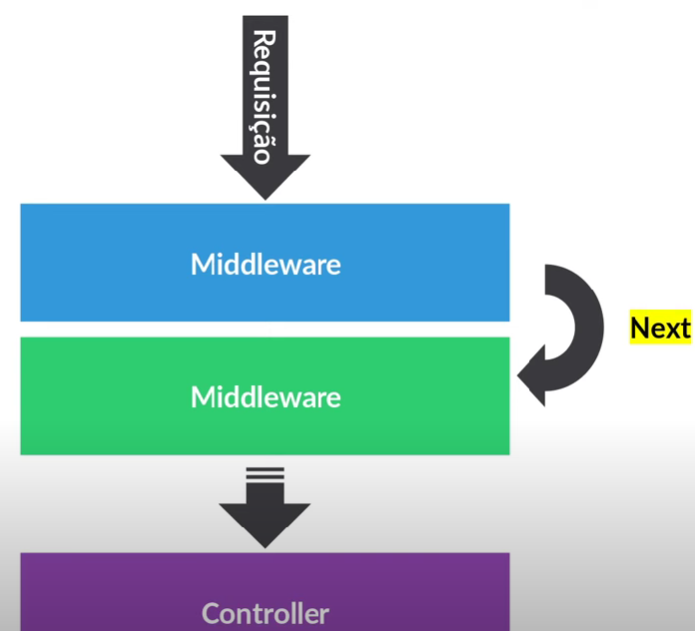

# 🧠 Aula 11 - Validações

## 🎯 Objetivos
- Entender o processo de validações e restrições
- Identificar como podemos implementar validações
- Validação com Sequelize
- Validação com Middleware


---
## 📐 Diferença entre validações e restrições
> As validações são executadas no nível do *sequelize*, em javascript puro. Se a validação falhar, nenhuma consulta é enviada para o banco de dados.
> Por outro lado, as restrições (constraints) são regras definidas no SQL, logo a consulta é encaminhada ao banco de dados, assim se a restrição falhar um erro será gerado pelo banco de dados e o *sequelize* encaminhará o erro para o *javascript*. Observe que neste caso a consulta foi encaminhada ao banco de dados. No exemplo abaixo temos o campo `username` definido com uma restrição de **único**.

```js
/* ... */ {
  username: {
    type: DataTypes.TEXT,
    allowNull: false,
    unique: true
  },
} /* ... */
```

## 🧪 Aplicando validações nas requisições recebidas
> Podemos aplicar validações dos dados de duas formas:
> * Usando o próprio Sequelize
> * Usando uma camada de middleware

### 📝 Como funciona o processo de validação usando o Sequelize
> O processo de validação dos dados usando o *sequelize* é aplicado diretamente nos *models* usando o *validate*. Observe o exemplo abaixo:

```js
import Sequelize, { Model } from 'sequelize';

class Customer extends Model {
  static init(sequelize) {
    super.init({
      name: {
        Sequelize.STRING,
        validate: {
            notEmpty: { msg: 'Name cannot be empty' },
            len: { args: [3, 50], msg: 'Name must be between 3 and 50 characters long' }
        }
      },
      email: {
        type: Sequelize.STRING,
        allowNull: false,
        unique: true,
        validate: {
          isEmail: { msg: 'Must be a valid email address' },
          notEmpty: { msg: 'Email cannot be empty' }
        }
      },
      age: {
        type: Sequelize.INTEGER,
        validate: {
            notEmpty: { msg: 'Age cannot be empty' },
            isInt: { msg: 'Age must be a integer' }
            min: { args: 18, msg: 'Age must be great 18 yers old' }
        }
      }
```

> Podemos encontrar mais detalhes na documentação oficial do [Sequelize](https://sequelize.org/docs/v6/core-concepts/validations-and-constraints/).
> Vamos aplicar alguns processos de validações no nosso código.

---
### ✅ Validações usando o middleware
> Quando usamos *middleware* para executar processos de validações, devemos enteder que um *middleware* é uma coleção de funções com acesso às requisições, respostas e a próxima função. Portanto nosso middleware pode executar qualquer código, pode executar mudanças nos objetos da solicitação e/ou resposta, encerrar o ciclo de solicitação-resposta, podem chamar a próxima função da pilha. Podemos usar ou criar middlewares:
- Nível de aplicativo
- nìvel de roteador
- Nível de manipulação de erros
- Integrado
- De terceiros



> Outro ponto importante sobre os *middlewares* é que podem ser globais ou locais.
- Middleware Global são aplicados para todas as rotas na aplicação ou a um conjunto amplo de rotas, normalmente são usadas para log, autenticação ou manipulação da requisição ou resposta. É registrado com `app.use()`.
- Middleware Local é aplicado apenas a rotas específicas, é colocado como argumento diretamente na rota, usado para validação de dados, autorização de rotas especificas, etc.


`middleware-global.js`
```js
const express = require('express');
const app = express();

// Middleware global
app.use((req, res, next) => {
  console.log(`Requisição recebida: ${req.method} ${req.url}`);
  next(); // Passa para o próximo middleware ou rota
});

app.get('/', (req, res) => {
  res.send('Rota principal');
});

app.listen(3000, () => console.log('Servidor rodando na porta 3000'));
```

`middleware-local.js`
```js
const express = require('express');
const app = express();

// Middleware local
const verificarAutenticacao = (req, res, next) => {
  const autenticado = false; // Simulação de autenticação
  if (autenticado) {
    next(); // Usuário autenticado, segue para a rota
  } else {
    res.status(401).send('Acesso não autorizado');
  }
};

// Aplicando middleware local em uma rota específica
app.get('/rota-protegida', verificarAutenticacao, (req, res) => {
  res.send('Bem-vindo à rota protegida!');
});

app.listen(3000, () => console.log('Servidor rodando na porta 3000'));
```

> Vamos agora aplicar validações no nosso código.
---