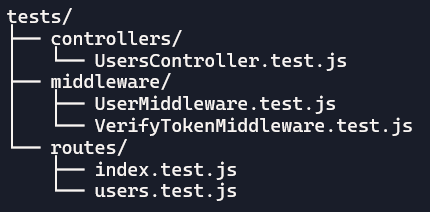
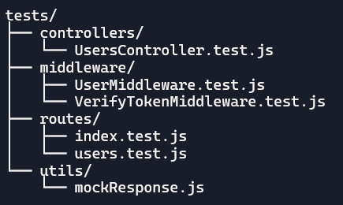

# 📝 Aula 18 - Testes automatizados

## 🎯 - Objetivos
- Entender fundamentos de testes unitários e de integração.
- Aplicar Jest, Supertest e mocks para cobrir middlewares, controllers e rotas.
- Configurar ambiente de testes com cobertura e execução em CI.
- Implementar o processo de testes automatizados.

---
## 🧩 - Tipos de testes
> O processo de testes é de grande importância no processo de desenvolvimento de software, tanto para garantir o funcionamento correto da aplicação como na questão de segurança. Abaixo uma pequena explanação dos tipos de testes e seu significado.
- Testes Unitários: Validam funções isoladas (ex: serviços, helpers, validações).
- Testes de Integração: Verificam se os módulos funcionam bem juntos (ex: rotas + controllers + banco).
- Testes de Contrato / Schema: Garantem que os dados recebidos/enviados seguem o formato esperado.
- Testes de Cobertura de Erros: Simulam falhas (ex: banco fora do ar, dados inválidos).

---
## 📊 - Cobertura recomendada


---
## 📌 - Preparando o ambiente
> Precisamos implementar mais alguns middlewares no nosso NodeJS para seguir com os processos de dados. Para isto vamos executar a instalação:
```bash
npm install --save-dev jest supertest @faker-js/faker
```
> Isto vai instalar os pacotes no ambiente de DEV, não criando implementação destes pacotes para ambiente de produção.

---
## ⚙️ - Configurações
> Precisamos criar as entradas de testes no *package.json*, vide abaixo:

`./package.json`
```json
  "scripts": {
    "start": "node src/server.js",
    "dev": "./node_modules/.bin/nodemon src/server.js",
    "test": "jest --runInBand",
    "test:watch": "jest --watch",
    "test:coverage": "jest --coverage"
  },
```

> Devemos garantir que nosso `.env` tem as entradas para **JWT_SECRET** e **JWT_EXPIRES**.
`./.env`
```js
# API configuration
PORT=8080
# database configuration
USERNAMEDB='meuusuario'
PASSWORDDB='minhasenhadobanco'
HOSTDB='localhost'
PORTDB='3306'
NAMEDB='minhabasededados'
# sequelize configuration
DIALECTDB='mariadb'
# JWT secret
JWT_SECRET='gravarUmaS&nhaF0rte@qui'
JWT_EXPIRES=3600
```

---
## 🏗️ - Estrutura de testes
> Para que possamos executar os testes, vamos precisar construir uma estrutura de pastas para organizar os diversos aquivos que serão escritos.




> Vamos criar o arquivo de configuração do Jest.
`./jest.config.js`
```js
export default {
  testEnvironment: 'node',
  extensionsToTreatAsEsm: ['.js'],
  setupFiles: ['dotenv/config'],
  collectCoverage: true,
  coverageDirectory: 'coverage',
  collectCoverageFrom: ['src/**/*.{js}'],
  moduleNameMapper: {
    // Se usar aliases, por ex: '@models/(.*)': '<rootDir>/src/models/$1'
  }
};
```