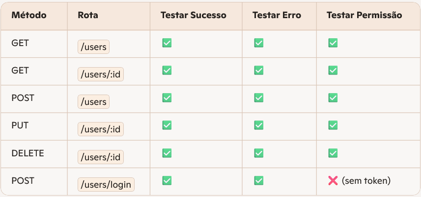
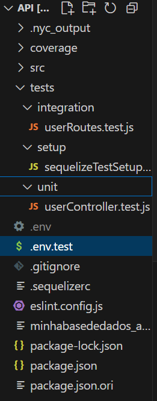

# 📝 Aula 18 - Testes automatizados

## 🎯 - Objetivos
- Entender fundamentos de testes unitários e de integração.
- Aplicar Jest, Supertest e mocks para cobrir middlewares, controllers e rotas.
- Configurar ambiente de testes com cobertura e execução em CI.
- Implementar o processo de testes automatizados.

---
## 🧩 - Tipos de testes
> O processo de testes é de grande importância no processo de desenvolvimento de software, tanto para garantir o funcionamento correto da aplicação como na questão de segurança. Abaixo uma pequena explanação dos tipos de testes e seu significado.
- Testes Unitários: Validam funções isoladas (ex: serviços, helpers, validações).
- Testes de Integração: Verificam se os módulos funcionam bem juntos (ex: rotas + controllers + banco).
- Testes de Contrato / Schema: Garantem que os dados recebidos/enviados seguem o formato esperado.
- Testes de Cobertura de Erros: Simulam falhas (ex: banco fora do ar, dados inválidos).

---
## 📊 - Cobertura recomendada


---
## 📌 - Preparando o ambiente
> Precisamos implementar mais alguns middlewares no nosso NodeJS para seguir com os processos de dados. Tendo em vista que nosso desenvolvimento está modelado sobre OOP e usando notação ES6, o jest vai ter necessidade do babel para "traduzir" os códigos, assim vamos usar o Mocha (biblioteca para escrever os testes), Supertest (biblioteca para enviar requisições HTTP para testes de APIs), Chai (biblioteca de asserção - métodos para validar os resultados) e Nyc (gera report de cobertura dos testes).
Para isto vamos executar a instalação:
```bash
npm install --save-dev mocha chai supertest sinon sequelize-mock nyc sqlite3
```
> Isto vai instalar os pacotes no ambiente de DEV, não criando implementação destes pacotes para ambiente de produção.

---
## ⚙️ - Configurações
> Precisamos criar as entradas de testes no *package.json*, vide abaixo:

`./package.json`
```json
  "scripts": {
    "start": "node src/server.js",
    "dev": "./node_modules/.bin/nodemon src/server.js",
    "test:unit": "mocha tests/unit/**/*.test.js",
    "test:integration": "mocha tests/integration/**/*.test.js",
    "test": "npm run test:unit && npm run test:integration",
    "coverage": "nyc npm test
  },
```

> Devemos garantir que nosso `.env.test` tem as entradas para **JWT_SECRET** e **JWT_EXPIRES**.
`./.env.test`
```js
DOTENV_CONFIG_QUIET=true

JWT_SECRET=testsecret
JWT_EXPIRES=1h
```

---
## 🏗️ - Estrutura de testes
> Para que possamos executar os testes, vamos precisar construir uma estrutura de pastas para organizar os diversos aquivos que serão escritos.



> Vamos criar o arquivo de configuração dos teste:
`./tests/setup/sequelizeTestSetup.js`
```js
// tests/setup/sequelizeTestSetup.js
import { Sequelize } from 'sequelize';
import UserModel from '../../src/models/UserModel.js';

export const sequelize = new Sequelize('sqlite::memory:', {
  logging: false,
});

export const initModels = () => {
  UserModel.init(sequelize);
  // Se tiver associações, chame aqui também
  // UserModel.associate({ ... });
};

export const syncDatabase = async () => {
  await sequelize.sync({ force: true });
};
```

> Criando um modelo para testes de unidade:
`./test/unit/userController.test.js`
```js
import { expect } from 'chai';
import sinon from 'sinon';
import { Op } from 'sequelize';
import UsersController from '../../src/controllers/UsersController.js';
import User from '../../src/models/UserModel.js';
import dotenv from 'dotenv';
dotenv.config({path: '.env.test'});

describe('Unitário - UsersController', () => { // Descricao do que é o teste
  afterEach(() => sinon.restore());            // Reset das variaveis criadas para os testes

  it('Login - Deve retornar 200 com token válido', async () => {  // O it cria o teste em sí
    const req = {                                                 // Definimos a req
      body: { email: 'teste@exemplo.com', password: 'senha1234' }
    };

    const res = {                                                 // Definimos a resposta (aqui entra o mock)
      status: sinon.stub().returnsThis(),
      json: sinon.stub()
    };

    const fakeUser = {
      id: 1,
      email: req.body.email,
      isAdmin: false,
      status: 1,
      password: req.body.password,
      checkPassword: sinon.stub().resolves(true)
    };

    sinon.stub(User, 'findOne').resolves(fakeUser);
    // Com tudo que foi preparado, executamos a requisição ao método (nossa unidade)
    await UsersController.login(req, res);
    // Avaliamos o retorno
    expect(res.status.calledWith(200)).to.be.true;  // Retornou HTTP 200?
    expect(res.json.firstCall.args[0]).to.have.property('token'); // No retorno veio um json contendo uma propriedade com nome "token"?
  });
```

> **Importante**: Construir testes automatizados é como codificar as regras de negócio. Depende de conhecer os middlewares (ferramentas) que serão usadas. Portanto carece de estudo sobre a aplicação. É necessário também conhecer o que o código está "fazendo", resalvo novamente sobre a importância da documentação.